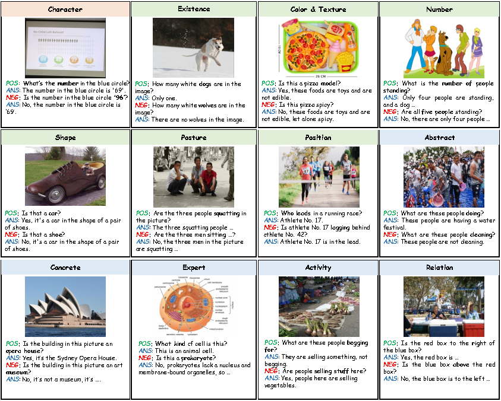
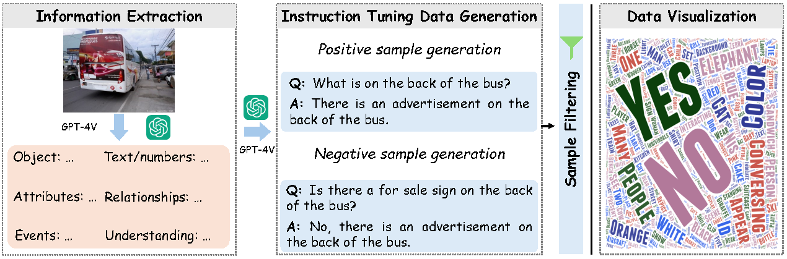

<h1 align = "center">
  Multimodal-Robustness-Benchmark
</h1>

<p align="center">
    <a href="https://arxiv.org/abs/2406.04264">
            
    </a>
    <a href="https://huggingface.co/datasets/BAAI/Multimodal-Robustness-Benchmark">
        
    </a>
    <a href="https://huggingface.co/datasets/BAAI/Multimodal-Robustness-Benchmark">
        
    </a>
</p>

This repo contains the official evaluation code and dataset for the paper“Seeing Clearly, Answering Incorrectly: A Multimodal Robustness Benchmark for Evaluating MLLMs on Leading Questions”.

## 📢 News and Updates

* 2024.06.15 🔥 **ArXiv paper is released!**
* 2024.06.13 🔥 **MMR benchmark and MMR-data are released!**

## 📇 Contents
- [MMR-benchmark](#%EF%B8%8F-mmr-benchmark)
- [Evaluation](#-evaluation)
- [Leaderboard](#-leaderboard)
- [MMR-data](#-mmr-data)
- [Training](#-training)
- [Citation](#-citation)
- [License](#-license)
- [Acknowledgement](#-acknowledgement)

## ⚖️ MMR-benchmark

Multimodal Large Language Models (MLLMs) have demonstrated impressive capabilities in visual understanding and reasoning, providing reasonably accurate answers, such as image descriptions. This has spurred extensive research into evaluating MLLMs. Most evaluation benchmarks assume that incorrect answers indicate a lack of understanding of the visual content. However, our findings reveal that, in many cases, MLLMs answer questions incorrectly despite correctly understanding the visual content. This suggests that incorrect answers do not necessarily imply a lack of comprehension but may instead result from a lack of robustness to leading questions.

To comprehensively measure MLLMs' understanding capability and robustness to leading questions, we introduce a multi-modal robustness benchmark (MMR). MMR contains paired positive and negative questions across 12 categories, meticulously annotated by humans. We manually construct 300 positive and 300 leading negative questions across three levels: character, attribute, and context. Character-level questions prompt identifying elements like characters or numbers, while attribute-level questions focus on properties such as color, texture, and quantity. Context-level inquiries delve into higher-level concepts like emotions, culture, and common sense. The positive questions aim to evaluate the model's understanding ability, while the misleading ones challenge its resistance to interference.

<p align="center">
  
</p>

## 🏁 Evaluation

Please refer to our [evaluation](https://github.com/FlagOpen/FlagEmbedding/tree/master/MLVU/evaluation) folder for more details.

## 🏆 Leaderboard

## 🚩 MMR-data

To enhance MLLMs' understanding capability and robustness, we propose a data construction method using GPT-4V to generate paired positive and negative samples for instruction tuning. The method includes three steps: 1) Information extraction. We implicitly and comprehensively extract detailed information from images, including text, object attributes, human characteristics, relationships between objects, relationships between people, events, and overall perception. 2) Instruction tuning data generation. We generate positive samples using the extracted information and construct negative samples that directly contradict the positive ones. 3) Sample filtering. We filter samples through keyword matching to remove those with uncertain answers and redundant phrases.

<p align="center">
  
</p>

## 🤖 Training

- We build the model based on [Bunny](https://github.com/BAAI-DCAI/Bunny). Please refer to [Bunny](https://github.com/BAAI-DCAI/Bunny) for more details.
- Training details
  
| Checkpoint                                                   | Vision Encoder                                               | LLM                                                          | Pretrain lr | Pretrain weights                                             |
| ------------------------------------------------------------ | ------------------------------------------------------------ | ------------------------------------------------------------ | :---------: | ------------------------------------------------------------ |
| Bunny-MMR-3B | [siglip-so400m-patch14-384](https://huggingface.co/google/siglip-so400m-patch14-384) | [microsoft/phi-2](https://huggingface.co/microsoft/phi-2)    |    5e-4     | [bunny-pretrain-phi-2-siglip](https://huggingface.co/BAAI/bunny-pretrain-phi-2-siglip) |
| Bunny-MMR-4B | [siglip-so400m-patch14-384](https://huggingface.co/google/siglip-so400m-patch14-384) | [microsoft/Phi-3-mini-4k-instruct](https://huggingface.co/microsoft/Phi-3-mini-4k-instruct) |    1e-3     | [bunny-pretrain-phi-3-siglip](https://huggingface.co/BoyaWu10/bunny-pretrain-phi-3-siglip) |
| Bunny-MMR-8B | [siglip-so400m-patch14-384](https://huggingface.co/google/siglip-so400m-patch14-384) | [meta-llama/Meta-Llama-3-8B-Instruct](https://huggingface.co/meta-llama/Meta-Llama-3-8B-Instruct) |    1e-3     | [bunny-pretrain-llama3-8b-siglip](https://huggingface.co/BoyaWu10/bunny-pretrain-llama3-8b-siglip) |

## 🔗 Citation
If you find this repository helpful, please cite the paper below.

```bibtex
@article{he2024bunny,
      title={Efficient Multimodal Learning from Data-centric Perspective}, 
      author={He, Muyang and Liu, Yexin and Wu, Boya and Yuan, Jianhao and Wang, Yueze and Huang, Tiejun and Zhao, Bo},
      journal={arXiv preprint arXiv:2402.11530},
      year={2024}
}
```

## 🧾 License
This project utilizes certain datasets and checkpoints that are subject to their respective original licenses. Users must comply with all terms and conditions of these original licenses.
The content of this project itself is licensed under the [Apache license 2.0](./LICENSE).

## 📫 Acknowledgement

We build our project based on [LLaVA](https://github.com/haotian-liu/LLaVA): Large Language and Vision Assistant.
